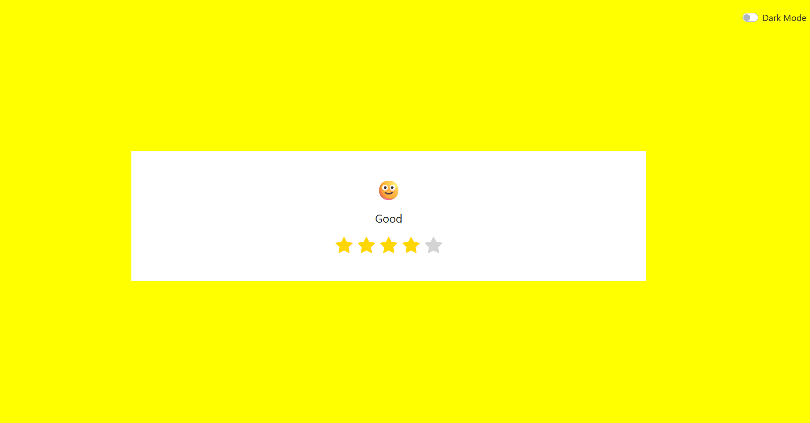

# Emoji Feedback with Star Ratings

An interactive and visually appealing feedback component where users can rate their experience using star ratings, responsive emoji expressions, and optional dark mode.

---

## 📷 Preview



---

## Objective

Create a clean and responsive feedback UI where users can:

- Select a rating using interactive stars.
- View dynamic emoji expressions based on the rating.
- Enable dark mode for better visual accessibility.
- Optionally provide more feedback after rating (future enhancement).

---

## Features

### Core Functionality
- **Interactive Star Rating System**
  - 5 clickable stars (`bi-star-fill`) from Bootstrap Icons.
  - Tooltip hints on hover (e.g., "Terrible", "Excellent").
  - Active star highlighting based on click.
  
- **Dynamic Emoji Feedback**
  - Emoji changes based on selected star rating:
    - 😡 → 1 star
    - 😕 → 2 stars
    - 😐 → 3 stars
    - 🙂 → 4 stars
    - 😄 → 5 stars
  - Text label reflects rating sentiment (e.g., "Good", "Terrible").

- **Dark Mode Toggle**
  - Accessible switch to toggle dark/light theme.
  - Smooth transition and well-contrasted design.

---

## Tech Stack

| Layer     | Technology            |
|-----------|------------------------|
| Structure | HTML5                 |
| Styling   | CSS3, Bootstrap 4      |
| Icons     | Bootstrap Icons, Font Awesome |
| Logic     | JavaScript      |

---

## How It Works

- **JS Logic**:
  - On clicking a star, JavaScript updates:
    - Star highlighting using `classList.add('active')`
    - Emoji and label via arrays `emojiMap[]` and `labelMap[]`

- **Dark Mode**:
  - Toggle switch updates the class on `<body>`
  - Changes background, emoji color, and star theme accordingly.

---

## 🛠 Setup Instructions

1. **Clone the Repository**:
   ```bash
   git clone https://github.com/your-username/emoji-feedback-rating.git
